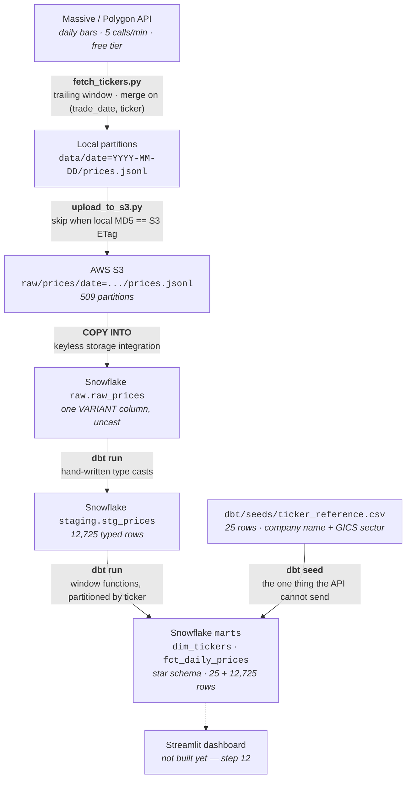

# Market Data Pipeline

A daily batch pipeline for US equity prices: **API → local partitions → S3 → Snowflake → dbt**.
Two years of daily bars for 25 large-cap tickers, landed once and reloadable from scratch in
about twenty minutes.

Everything below has been run. The numbers are measured, not estimated.

---

## The problem

I wanted daily closing prices for a set of tickers, kept current, in a warehouse I could query
and eventually put a dashboard on. The interesting part is not fetching the data — that is one
`requests.get`. It is everything that has to be true for a *daily* job:

- The source is rate-limited to 5 calls a minute and publishes a day's close overnight, so
  "today's close" does not exist when a morning job runs.
- A run can be missed, interrupted, or repeated. None of those may corrupt what is already stored.
- The data has a type trap in it (below) that silently breaks anything that infers schema from
  a sample.
- Three different systems need three different kinds of credential, and none of them can end up
  in git.

This repository is my answer to those four, one file at a time.

---

## Architecture



Nothing schedules this yet — I run it by hand. Putting it behind an orchestrator is step 10,
and the pipeline was built to make that step boring: every stage is already safe to re-run.

---

## What is actually in the warehouse

| | |
|---|---|
| Tickers | 25 large-caps across 8 GICS sectors (`tickers.txt`; names and sectors in `dbt/seeds/ticker_reference.csv`) |
| Trading days | 509 — 2024-08-26 through 2026-09-04 |
| Rows | 12,725 in `raw.raw_prices`, 12,725 in `staging.stg_prices` |
| Distinct `(ticker, trade_date)` | 12,725 |
| Marts | `marts.dim_tickers` 25 rows · `marts.fct_daily_prices` 12,725 rows |
| `COPY INTO` | 509/509 files loaded, 0 errors |
| Re-run of the same `COPY INTO` | `Copy executed with 0 files processed.` |

509 × 25 = 12,725, and every date is complete for all 25 tickers.

It was not always. For two weeks the table held 12,529 rows across 503 dates, and this README
explained the shortfall by saying the rows were absent upstream at the provider. They were not.
Two of those dates came from my own smoke-test runs rather than a full pass — 2026-08-26 held
three tickers and 2026-08-27 held one — which is exactly the four rows that 12,525 and 12,529
differ by, a fact that had been sitting in my own notes for ten days before I read it properly.
A count per date said so in one query. Both dates filled in on the next full run.

---

## Idempotency, measured at three layers — and then at the seams

Re-running any stage changes nothing. That is the property the whole design is organised
around, and each layer earns it differently:

| Layer | Mechanism | Measured result |
|---|---|---|
| Local files | Each run fetches a trailing **window** of days and merges on `(trade_date, ticker)`; writes go to a temp file and are swapped in with an atomic `replace()` | 25 tickers over a 14-day window, 250 bars returned: **10 day files touched, 0 rewritten** |
| S3 | One `ListObjectsV2` returns every key with its ETag; for a single-part upload the ETag *is* the content MD5, so unchanged files are skipped without downloading anything | **0 uploaded, 509 skipped, 0 bytes sent** |
| Snowflake | `COPY INTO` consults its own load history and ignores files it has already loaded | **`Copy executed with 0 files processed.`** |

Those three results are one sequence, run in order, starting from a live fetch of every ticker.
That they are consecutive is the point, and it is a more recent claim than it looks.

The trailing window is why a missed day is not a lost day. If the job does not run for three
days, the next run backfills them without being told to; a bar that published late gets picked
up on the following run. I chose a window over "fetch yesterday" for that reason, and it is the
decision the rest of the design leans on hardest.

### Each layer was correct and the pipeline still was not

For two weeks I had a version of that table and believed the composition followed from it. It
does not, and the reason turned out to be worth more than the property.

Every layer had been tested by running that one stage twice with nothing in between — which is
precisely the condition under which nothing upstream has changed the bytes. Run the whole chain
instead and something else happens. `fetch_tickers.py` used to re-stamp `ingested_at_utc` on
every row on every run, deliberately, so the stamp would mean "when this row was last seen". A
trailing window re-fetches days whose prices settled weeks ago; those rows got a new stamp, so
the file's bytes changed, so its MD5 no longer matched the S3 ETag, so it was re-uploaded — and
Snowflake skips a staged file only when it has loaded that file before **and** the file has not
changed since. So the file loaded again, in full.

The run that found it: 10 day files touched, 10 re-uploaded, 10 re-copied, 250 rows added, of
which **54 were duplicates**. Twenty-five of those came from a single date that had gained no
new data at all. The arithmetic is what makes it a mechanism rather than a coincidence —
25 + 25 + 3 + 1, one term per file that already had rows in it.

Nothing raised an error anywhere. It surfaced because `scripts/snowflake_copy.py` compares
`COUNT(*)` against `COUNT(DISTINCT (ticker, trade_date))` after every load and exits non-zero
when they differ. That check was written before I knew this was a real risk, for no better
reason than that `sql/06_snowflake_raw_load.sql` states the invariant in a comment.

The fix is in the merge, not in the warehouse. A row whose bar came back unchanged keeps its
original `ingested_at_utc`, and a day file whose content is unchanged is not rewritten at all —
so unchanged bytes now propagate all the way down. `ingested_at_utc` means *first seen, or last
seen to change*; when a row last reached the warehouse is a different question, and
`raw_prices.loaded_at` answers it. Deduplicating in the staging model would also have made the
symptom go away, in one line, which is the same objection as the one below.

---

## Three credentials, three different answers

The pipeline authenticates to three systems, and each one gets a different credential model
because each has a different constraint. This is the part of the project I would most want to
talk through.

| Hop | Credential | Why this one |
|---|---|---|
| Python → AWS S3 | IAM **user** with long-lived access keys | The uploader runs on a laptop and later under a scheduler with no human present to complete an SSO login. IAM Identity Center is the better default and it does not fit an unattended process. The blast radius is capped instead: one customer-managed policy, write and list on one prefix, **no `DeleteObject`**, and no console login on the user. |
| S3 → Snowflake | Keyless assumed **IAM role** (storage integration) | No key exists to leak. Snowflake holds an ARN and an external ID and assumes the role; the trust policy names the external ID so nobody else's Snowflake account can assume it. The IAM policy grants read and list only — Snowflake's own template ships `PutObject` and `DeleteObject` and I trimmed both. |
| dbt → Snowflake | **RSA key pair** | Passwords are being retired. Snowflake's rollout enforces multi-factor sign-in on my account from 2026-09-09 — the vendor's general documentation says trial accounts are exempt, and the banner on my own account said otherwise. A key pair is immune to every phase of that rollout, which made the contradiction irrelevant rather than something I had to adjudicate. No password exists anywhere in this project's Snowflake path. |

Two supporting details worth naming. The key pair is generated with Python's `cryptography`
library rather than by shelling out to `openssl`, because macOS ships **LibreSSL** under that
name and it differs from OpenSSL on exactly the PKCS#8 flags Snowflake's documented commands
use. And `~/.dbt/profiles.yml` is written outside the repository at mode 600, with `profiles.yml`
and `*.p8` / `*.pem` / `*.key` in `.gitignore` anyway, so a key generated into the project folder
by mistake still cannot be staged.

### Secrets are kept out by a hook, not by discipline

`scripts/check_secrets.sh` scans staged files and exits non-zero on a finding, without ever
printing the value it found. `scripts/install_hooks.sh` wires it in as a `pre-commit` hook, so
git refuses the commit rather than relying on me to remember.

It exists in that form because remembering failed. I once ran the checker as one of four pasted
commands; it printed STOP and exited 1, and the shell ran `git commit` and `git push --force-with-lease`
anyway, because pasted lines execute independently of each other's exit status. A check that has
to be remembered is a check that will be skipped.

The checker has since blocked two commits and been right both times. Its strongest rule is also
its simplest: grep the staged content for the literal values in `.env`. That one has zero false
positives by construction. An earlier version matched key *shapes* and fired five times on a
genuinely clean repository — including on `api_key = os.getenv("POLYGON_API_KEY")`, which is the
correct pattern. It now matches key *material*: a credential assignment needs a quoted literal of
at least 12 characters, which `os.getenv(...)` is not. Eleven test cases cover it, including all
five of those false positives as regressions.

---

## Decisions worth explaining

**Raw stays raw — one `VARIANT` column, uncast.** `raw_prices` holds the JSON line exactly as it
arrived, plus three lineage columns (`source_file`, `file_row_number`, `loaded_at`). No casting,
no renaming, no filtering. The first place a type gets decided is a file I can read, in this
repository, under version control. That file is `dbt/models/staging/stg_prices.sql`.

**The type trap that justifies it.** 26% of volume values come back fractional — and it is not
only volume. `open`, `high`, `low` and `close` serialize as JSON *integers* whenever a price lands
exactly on the dollar. Five columns, all of which anything inferring types from a sample would get
wrong. AAPL closed at exactly `229` on 2024-08-30 and that is the **first row of the raw table**,
so a schema inferred from the head of the file types five FLOAT columns as INTEGER. `VARIANT`
absorbed it; the hand-written `::float` casts in the staging model resolved it. Verified in
`information_schema`: that column is FLOAT and the value is 229.

**No deduplication in staging.** A `qualify row_number() over (partition by price_key ...) = 1`
would be one line and would guarantee this table always looks correct. That is the objection to
it. The duplicate it silently absorbed would be a real load fault upstream, and the uniqueness
test in step 11 — whose entire purpose is to catch exactly that — would be permanently, uselessly
green. The staging layer's job is to make raw data typed and legible, not to make it look clean.

**A table, not a view.** dbt's convention for a staging layer is a view. I chose a table: the
step's definition of done was one clean table, 12,725 rows is kilobytes, and the dashboard in
step 12 reads this object on every page load. If that calculus changes it is one word in
`dbt_project.yml`.

**`raw_prices` is declared as a dbt source, not a hard-coded three-part name.** Lineage then
starts at S3 rather than at the staging model, and the freshness tests in step 11 have a node to
attach to.

**The marts layer is a star, and its key is the ticker symbol.** `dim_tickers` says what a symbol
*is* — company, sector, how much history the warehouse holds for it. `fct_daily_prices` says what
*happened* — one row per ticker per trading day, with the derived measures a chart needs and the
API does not send. Kimball's textbook answer would give the dimension a surrogate integer key; I
used the symbol. Surrogate keys mainly exist to serve Type 2 slowly-changing dimensions, where one
real ticker needs several rows and the natural key stops being unique. This dimension is Type 1 —
25 large-caps whose sectors do not move — so the symbol is still unique, stable and readable, and
a surrogate would buy a join hop and a package dependency. A Type 2 snapshot over data that never
changes would demonstrate the pattern without testing it.

**Every window partitions by ticker, and that is load-bearing.** Without `partition by ticker`
these functions walk one stream of every row ordered by date, where the row before any given
AAPL row is a different company on the same day. I measured that rather than assuming it: computing
`prior_close` both ways over the 12,529 rows the table held at the time, **12,526 of them
disagree**. The three that agree are the first
row of the table, where both versions are null, and two coincidences where two companies closed at
the same price on adjacent rows. No error, no warning — a column of numbers that are almost all
wrong and all look reasonable. The check for it is cheap and binary: `prior_close` must be null on
exactly **25** rows, one per ticker. Drop the partition and it is null on one.

**A partial window is not a smaller answer to the same question.** `moving_avg_20d` is null for
each ticker's first nineteen rows rather than averaging however many days happen to exist. Without
that guard, row five reports the mean of five days in a column named for twenty, and nothing about
it looks wrong — AAPL's nineteenth row would have read `223.5332`, a perfectly reasonable-looking
number. The same rule governs the rolling 52-week high and low, which need 252 sessions and are
therefore null across roughly half of this two-year dataset. And `rows between 19 preceding`, not
`range`: twenty *sessions* is what a 20-day average means to anyone reading prices, where `range`
would count by calendar date and sweep in the weekends.

**Sector lives in a seed, and its types are declared.** No price API sends a company's sector, so
the 25 symbol/name/sector rows are a CSV in this repository that `dbt seed` loads into the
warehouse — version-controlled and readable as a diff, rather than parsed out of the comments in
`tickers.txt`, which would make a cosmetic line load-bearing. The column types are written down in
`dbt_project.yml` rather than inferred from the file, for the same reason the raw table is
`VARIANT`. The sectors are GICS, which puts Alphabet and Meta in Communication Services and Amazon
in Consumer Discretionary. The everyday grouping that calls all three Technology is not wrong; it
answers a different question than a chart axis labelled with a sector name does.

**dbt appends custom schemas, so the marts layer needed a macro.** Configuring `+schema: marts`
does not produce a schema called `marts`. dbt's built-in `generate_schema_name` concatenates it
onto the profile's schema and builds `staging_marts`. That behaviour is deliberate — it stops
developers on a shared warehouse from overwriting each other — and irrelevant on one laptop.
Overriding the macro in `dbt/macros/` is the documented fix and runs to ten lines. Staging models
carry no `+schema:` and are unaffected, which I confirmed by rebuilding them and reading back where
they landed rather than assuming.

**Partitioned by trade date, from the first line of Python.** `data/date=YYYY-MM-DD/prices.jsonl`
maps directly onto the S3 prefix and lets one prefix-wide `COPY INTO` load everything. Hive-style
`date=` folders are also what Snowflake, Spark and Athena expect to read as a partition key. The
tradeoff is many small files rather than a few large ones, which is stated in the uploader's
docstring rather than discovered later.

**Clocks are split on purpose.** "What trading day is it?" is always an Eastern question; instants
(run ids, ingest stamps) are always UTC. After 8pm ET the UTC date is already tomorrow, which
silently shifts the window and inflates the measured publication lag by a day — I made exactly
that mistake once. And on 2026-11-01 clocks fall back, so 1:30am ET happens twice.

**`requirements.txt` is hand-written, not `pip freeze`.** Freeze buries the three packages that
matter under their transitive dependencies. The pins that look arbitrary have reasons written next
to them in the file.

---

## Running it yourself

Python 3.13. Each stage is independent — you can stop after any of them and still have something
that works.

**1. Clone and install**

```bash
git clone https://github.com/pratik-j-patel/market-data-pipeline.git
cd market-data-pipeline
python3 -m venv .venv && source .venv/bin/activate
pip install -r requirements.txt
./scripts/install_hooks.sh          # once per clone — hooks are not cloned
```

**2. API key → local files**

Get a free key from [massive.com](https://massive.com) (formerly Polygon.io; `api.polygon.io`
still works).

```bash
cp .env.example .env
bash scripts/set_api_key.sh          # prompts; never echoes, never enters shell history
python fetch_one_ticker.py           # one price in the terminal — proves the key works
python fetch_tickers.py --backfill   # ~2 years for 25 tickers, ~5 minutes at 5 calls/min
```

Afterwards, `python fetch_tickers.py` fetches a 7-day trailing window. It exits non-zero if any
ticker failed, so a scheduler can tell a working run from a merely finished one.

**3. Local files → S3**

You need an S3 bucket and an IAM user. The uploader needs exactly two permissions:
`s3:PutObject` on `<bucket>/raw/prices/*`, and `s3:ListBucket` on the bucket.

Not `s3:GetObject` — it compares the ETag returned by the list call and never downloads
anything. Not `s3:DeleteObject` — an ingestion job has no business being able to delete, and
leaving it out means a bug in this code cannot destroy the landing zone. The policy documents
under `aws/` follow the same principle for the Snowflake role, with `<S3_BUCKET>` left as a
placeholder.

```bash
bash scripts/set_aws_keys.sh         # prompts for both keys and the bucket
python upload_to_s3.py --dry-run     # show what would change, touch nothing
python upload_to_s3.py
```

Run it twice. The second run should upload nothing.

**4. S3 → Snowflake**

Follow **[docs/snowflake_setup.md](docs/snowflake_setup.md)** — it is written as two trips to the
AWS console with Snowflake work in between, because the trust policy cannot be finished until
Snowflake has generated its external ID. Then run
[`sql/06_snowflake_raw_load.sql`](sql/06_snowflake_raw_load.sql) top to bottom.

One warning that costs an hour if you miss it: **never re-run `CREATE OR REPLACE STORAGE
INTEGRATION` after the trust policy is set.** It mints a new external ID, and every stage
operation then fails with an assume-role error that reads like a permissions bug.

**5. Snowflake → dbt**

Follow **[docs/dbt_setup.md](docs/dbt_setup.md)**.

```bash
bash scripts/set_dbt_profile.sh      # generates the RSA key pair, writes ~/.dbt/profiles.yml
cd dbt && dbt debug && dbt seed && dbt run
```

`dbt debug` before anything, always — a profile mismatch fails with a sentence about connections
instead of forty frames of stack trace. And `dbt seed` before `dbt run`: `dbt run` does not load
seeds, and `dim_tickers` reads one, so running the models alone fails on a table that was never
created.

**6. Running it again**

Once the setup above is done, the pipeline is four commands:

```bash
python fetch_tickers.py              # 7-day trailing window
python upload_to_s3.py
python scripts/snowflake_copy.py     # the COPY INTO from sql/06, as a script
cd dbt && dbt seed && dbt run
```

`scripts/snowflake_copy.py` exists so that the Snowflake load is callable rather than pasted into
a browser — a scheduler cannot use a worksheet. It reads its connection from the
`~/.dbt/profiles.yml` that step 5 wrote, so it holds no credential of its own; it runs the
verification query from `sql/06` section 6 and prints the counts; and it exits non-zero if the row
count and the distinct `(ticker, trade_date)` count ever disagree. **Zero files processed is a
success, not a failure** — that is the load history doing its job, and getting it backwards would
make a healthy pipeline go red every morning after the first.

Run those four twice in a row and nothing should move: 0 day files rewritten, 0 objects uploaded,
0 files copied. That is the property the section above is about, and it is worth checking rather
than assuming.

---

## Repository layout

```
fetch_one_ticker.py     One ticker, one price. The smallest thing that proves the key works.
fetch_tickers.py        The ingestion job: trailing window, rate limiting, retries, run manifest.
upload_to_s3.py         Partitions to S3, skipping anything whose MD5 already matches the ETag.
tickers.txt             The 25-symbol universe. Comments allowed.

sql/                    The Snowflake side: warehouse, storage integration, stage, COPY INTO.
aws/                    IAM policy and trust policy documents, with the bootstrap version kept.
dbt/                    dbt project: one source, a staging model, a seed, and the marts star.
docs/                   Runbooks for the two stages that involve a console: Snowflake and dbt.
notebooks/              How each step was worked out, with outputs kept as evidence.
scripts/                Credential setup, the Snowflake load, the secret scanner, the hook installer.
```

`notebooks/` keeps its outputs on purpose. They are the record that each stage ran and what it
returned — including [the batch-validation experiment that
failed](notebooks/step_3_ticker_loop.ipynb), where a `200 OK` and a well-formed response led to
the conclusion that Microsoft and Nvidia do not exist. The tell was `got back 1000` — exactly the
`limit` parameter. The filter had been silently ignored and an unfiltered alphabetical page came
back. A 200 means the message arrived, not that the server did what was asked.

---

## What I would do next

In the order I intend to build them:

1. **An orchestrator.** Airflow, replacing manual runs. Every stage is already re-runnable, so
   this step is about scheduling and observability rather than about correctness. It runs in the
   morning and expects yesterday's close, because a day's close is never available on that day.
2. **dbt tests and source freshness.** `stg_prices` already carries `price_key`, `source_file`,
   `file_row_number` and `loaded_at` for exactly this: uniqueness and not-null on the first,
   freshness on the last. The measure of success is breaking a source on purpose and having the
   run fail loudly.
3. **A Streamlit dashboard**, reading `marts.fct_daily_prices` joined to `marts.dim_tickers` on
   `ticker` — which is the whole reason those two tables exist.

Things I know are missing and have not pretended otherwise: there are no automated tests yet, and
nothing runs on a schedule. Each has a place in the list above.

---

## Cost

Roughly **$1–3/month** at this volume — an XS Snowflake warehouse billed by the second with a
60-second auto-suspend, plus a few megabytes of S3. The API tier is free.

The warehouse is not the source of truth; **S3 is.** If Snowflake were switched off tomorrow,
`sql/06_snowflake_raw_load.sql` rebuilds it from the same 509 files in about twenty minutes. That
was a design goal, not a happy accident.

I have since had cause to do it rather than claim it. Cleaning up the duplicate load described
above meant `TRUNCATE TABLE raw_prices` — which drops Snowflake's load history along with the
rows, so every file becomes loadable again — followed by one run of `scripts/snowflake_copy.py`.
From an empty table to 509 files and 12,725 rows took under a minute. The twenty minutes is the
setup around it, not the data.
